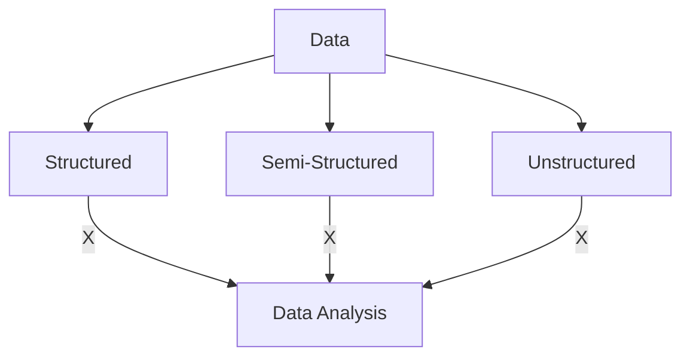
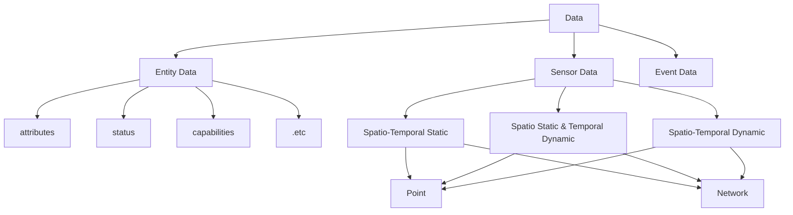

# Introduction
As we all know, there are many ways to divide data types. For example, it can be divided into structured data, semi-structured data, and unstructured data. But in the process of processing, we will find that although such a division is obvious, it can not play much role in the later analysis. This is one of the problems we often make in data analysis, that is, the work of data governance does not rely on modeling and analysis.

Therefore, according to the data collection scene and its attributes, we can divide the data into entity data, sensor data, and event data. Entity data, that is, its own data such as attributes, status, and capabilities. sensor data, that is, data generated by entities, can generally be divided into several types such as numerical values, pictures, text, and video. Event data, that is, structured information data.

The entity is data that everyone is very familiar with, such as demographic data that can be used for user portraits, and also a data set that everyone is very familiar with-iris. Sensor data is more complex and diverse than entity data. Generally speaking, it can be divided into six categories: spatio-temporal static point / network data, spatio static temporal dynamic point / network data, and spatio-temporal dynamic point / network data. In addition to the characteristics of the event itself, the event data also contains rich contextual information. An event is data generated in a spatio-temporal range, and it establishes a special relationship for the data in this spatio-temporal range.

Generally speaking, based on the difficulty of data analysis, entity data is the easiest to analyze. Because entity data contains very little dynamic information, the information that can be mined from it is limited. Compared with the entity data, the sensor data has more contextual information. This information can help us to establish the time series model of the entity itself and the time series model of interaction between multiple entities. It contains the largest amount of information, and the most difficult to analyze is event data, which includes both dynamic / static associations between entities and time series, and more importantly, the causal relationships inherent in it.

The recent rise of deep learning has led everyone to focus on building models. Thus, unfortunately, beginners often overlook the properties of the data itself and its applicable scenarios. We try to reduce everyone's misunderstanding and bias on data analysis. Meanwhile, we hope everyone can find the meaning of data mining during this round. We carefully selected the appropriate data set to locate the first round in the spatio static temporal dynamic point data in the relatively simple but still challenging sensory class of sensor data.
